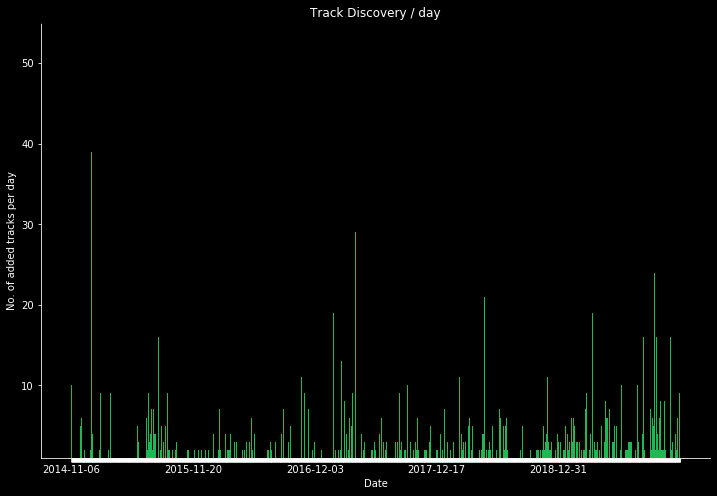

# spotifyscraper
A python API tool to extract statistical information about a Spotify users account history

TODO:
 - [x] set up spotify API calls
 - [x] new track addition frequency
 - [x] metric scatterplots
 - [x] average metric values
 - [ ] Export all tracks as CSV
 - [ ] Other data visualisations?
 - [ ] host as Flash/Django web app
 
 Sample Images:
 ---------
 
 
 
 

 
